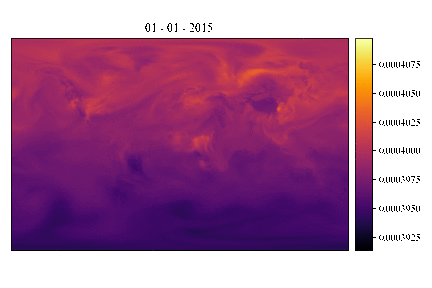

# Climate Sonification: Sonify NASA data on climate change during the Covid crisis 

In this project we use NASA's recently published data on regional effects of human activity on carbon dioxide emissions.
Due to the COVID lockdowns that happend at different moments in different areas, the researchers were able to disentangle 
human activitiy causes from natural ones.

#### Data

Detailed instructions for data access can be found [here](https://disc.gsfc.nasa.gov/data-access).

Short version:
1. Create [Earthdata account](https://disc.gsfc.nasa.gov/).
2. Run `setup.sh` and follow instructions.

Lists of URLs to download can be created here, but should already be in the repo:
- daily: 
  - https://disc.gsfc.nasa.gov/datasets/OCO2_GEOS_L3CO2_DAY_10r/summary?keywords=OCO2_GEOS_L3CO2_MONTH
  - https://cmr.earthdata.nasa.gov/search/concepts/C2240248762-GES_DISC.html
- monthly: 
  - https://disc.gsfc.nasa.gov/datasets/OCO2_GEOS_L3CO2_MONTH_10r/summary?keywords=OCO2_GEOS_L3CO2_MONTH
  - https://cmr.earthdata.nasa.gov/search/concepts/C2240248790-GES_DISC.html

#### Links

- NASA sonification examples: https://chandra.si.edu/sound
- news report: https://scitechdaily.com/nasa-makes-first-of-its-kind-detection-of-reduced-human-co2-emissions/ 
- tutorials for NetCDF format:
  - https://www.earthinversion.com/utilities/reading-NetCDF4-data-in-python/
  - http://schubert.atmos.colostate.edu/~cslocum/netcdf_example.html
- sonification tutorials
  - https://programminghistorian.org/en/lessons/sonification

#### References

1. Weir, B., Crisp, D., O’Dell, C. W., Basu, S., Chatterjee, A., Kolassa, J., Oda, T., Pawson, S., Poulter, B., Zhang, Z., Ciais, P., Davis, S. J., Liu, Z., & Ott, L. E. (n.d.). Regional impacts of COVID-19 on carbon dioxide detected worldwide from space. _Science Advances_, 7(45), eabf9415. https://doi.org/10.1126/sciadv.abf9415
