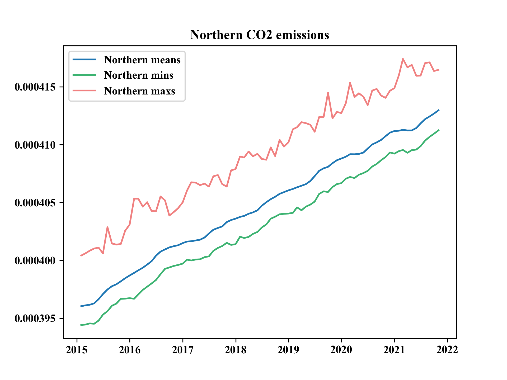
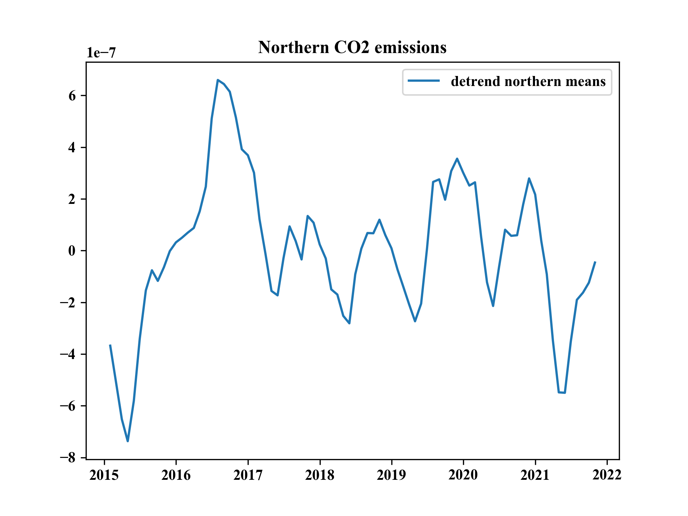
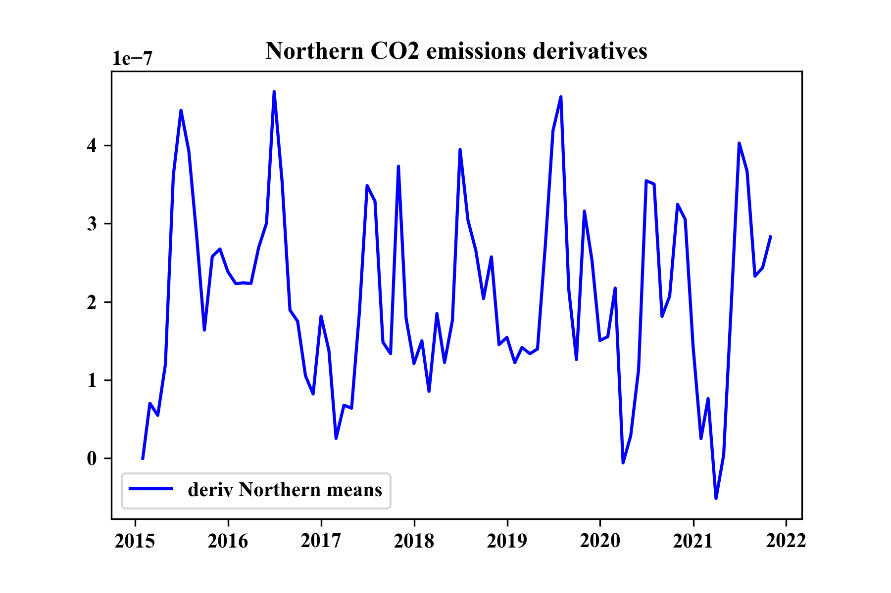

# Climate Sonification: Sonify NASA data on climate change during the Covid crisis 

_Iris Folpmers, Fabian C. Moss, Tobias Blanke_

In this project we use NASA's recently published data [1] on regional effects of human activity on carbon dioxide emissions.
Due to the COVID lockdowns that happend at different moments in different areas, the researchers were able to disentangle 
human activitiy causes from natural ones.

## Monthly data

The corresponding visualizations and sonification to section 3.2 of the thesis. All the sonifications were also used for the evaluation and section 4.1 of the thesis.
### Northern means

#### Visualisation

#### Sonification

This sonification was also used for the first question of the Evaluation in section 4.1.2 of the thesis.

If this sonification is not available, it can also be found on: https://drive.google.com/file/d/1t6Oo709IFgNUvufWuoMEXoQFuIA7YHF-/view?usp=sharing

### Northern detrended means

#### Visualisation

#### Sonification

This sonification was also used for the third question of the Evaluation in section 4.1.2 of the thesis.

If this sonification is not available, it can also be found on: https://drive.google.com/file/d/1LtSdiri5piYhK1C8_rzOf5104HZe66dV/view?usp=sharing

### Northern derivative of the means

#### Visualisation

#### Sonification

This sonification was also used for the second question of the Evaluation in section 4.1.2 of the thesis.

If this sonification is not available, it can also be found on: https://drive.google.com/file/d/1tx4QmoEpmvs1YeOEO9tY92PUl5XSx7c_/view?usp=sharing

#### Links

- NASA sonification examples: https://chandra.si.edu/sound
- news report: https://scitechdaily.com/nasa-makes-first-of-its-kind-detection-of-reduced-human-co2-emissions/ 
- tutorials for NetCDF format:
  - quick tutorial: https://www.earthinversion.com/utilities/reading-NetCDF4-data-in-python/
  - official documentation: https://unidata.github.io/netcdf4-python/

#### Sonification

- Astronify: https://astronify.readthedocs.io/en/latest/
- sonification tutorials
  - step-by-step guide: https://jupyter.brynmawr.edu/services/public/dblank/jupyter.cs/Sonification.ipynb
  - (https://programminghistorian.org/en/lessons/sonification)

#### References

1. Weir, B., Crisp, D., O’Dell, C. W., Basu, S., Chatterjee, A., Kolassa, J., Oda, T., Pawson, S., Poulter, B., Zhang, Z., Ciais, P., Davis, S. J., Liu, Z., & Ott, L. E. (n.d.). Regional impacts of COVID-19 on carbon dioxide detected worldwide from space. _Science Advances_, 7(45), eabf9415. https://doi.org/10.1126/sciadv.abf9415
