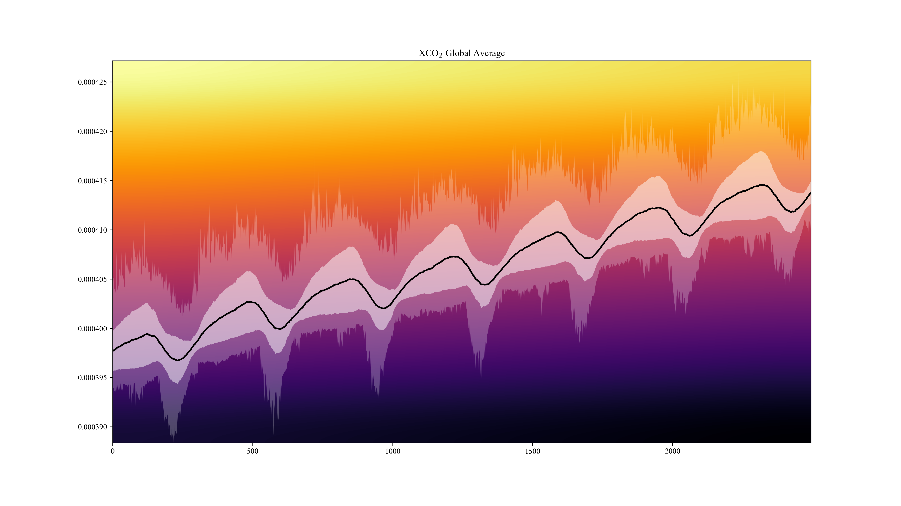

# Climate Sonification: Sonify NASA data on climate change during the Covid crisis 

_Iris Folpmers, Fabian C. Moss, Tobias Blanke_

In this project we use NASA's recently published data [1] on regional effects of human activity on carbon dioxide emissions.
Due to the COVID lockdowns that happend at different moments in different areas, the researchers were able to disentangle 
human activitiy causes from natural ones.

#### Project timeline

- ~~8 April: First meeting~~
- 15 April: Project Plan due
- 16-25 May: midterm presentation
- 1 July: Final deadline thesis

#### Data

Detailed instructions for data access can be found [here](https://disc.gsfc.nasa.gov/data-access).

To obtain data locally, follow these steps (**Be careful: loading the daily data took me about ~2h**)

1. Create [Earthdata account](https://disc.gsfc.nasa.gov/).
2. Run `setup.sh` and follow instructions.

If in Step 2 you were asked for lists links, you can obtain them here:
- daily: https://disc.gsfc.nasa.gov/datasets/OCO2_GEOS_L3CO2_DAY_10r/summary?keywords=OCO2_GEOS_L3CO2_MONTH
- monthly: https://disc.gsfc.nasa.gov/datasets/OCO2_GEOS_L3CO2_MONTH_10r/summary?keywords=OCO2_GEOS_L3CO2_MONTH

#### Links

- NASA sonification examples: https://chandra.si.edu/sound
- news report: https://scitechdaily.com/nasa-makes-first-of-its-kind-detection-of-reduced-human-co2-emissions/ 
- tutorials for NetCDF format:
  - quick tutorial: https://www.earthinversion.com/utilities/reading-NetCDF4-data-in-python/
  - official documentation: https://unidata.github.io/netcdf4-python/

#### Sonification

- Astronify - out of the box library for sonification: https://astronify.readthedocs.io/en/latest/
- sonification tutorials
  - step-by-step guide: https://jupyter.brynmawr.edu/services/public/dblank/jupyter.cs/Sonification.ipynb
  - (https://programminghistorian.org/en/lessons/sonification)

#### References

1. Weir, B., Crisp, D., O’Dell, C. W., Basu, S., Chatterjee, A., Kolassa, J., Oda, T., Pawson, S., Poulter, B., Zhang, Z., Ciais, P., Davis, S. J., Liu, Z., & Ott, L. E. (n.d.). Regional impacts of COVID-19 on carbon dioxide detected worldwide from space. _Science Advances_, 7(45), eabf9415. https://doi.org/10.1126/sciadv.abf9415
